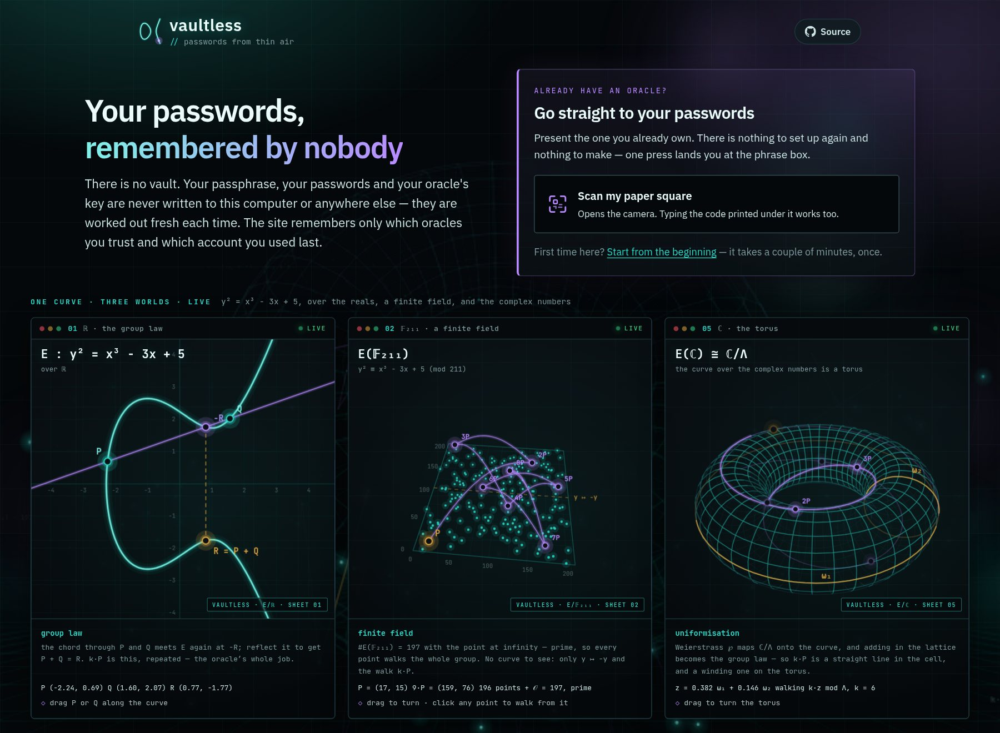
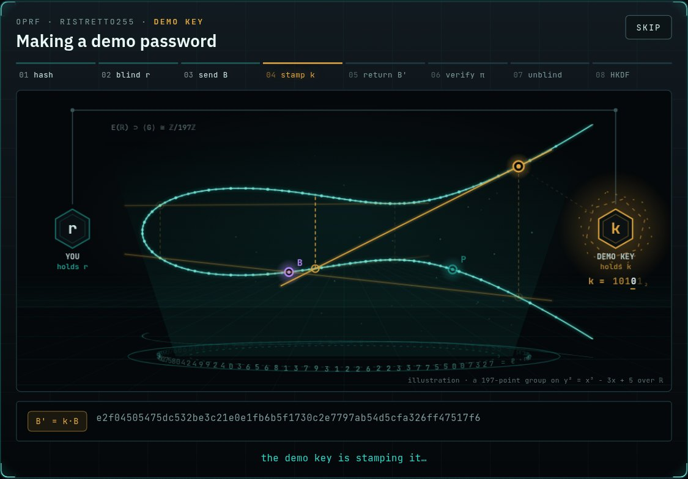
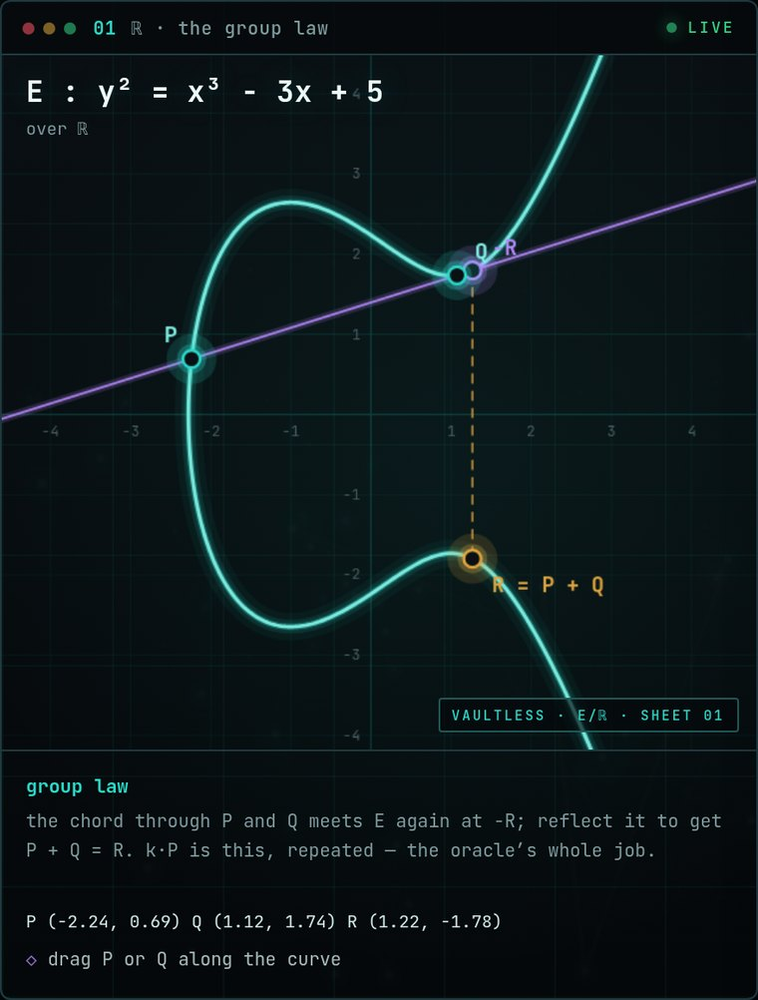
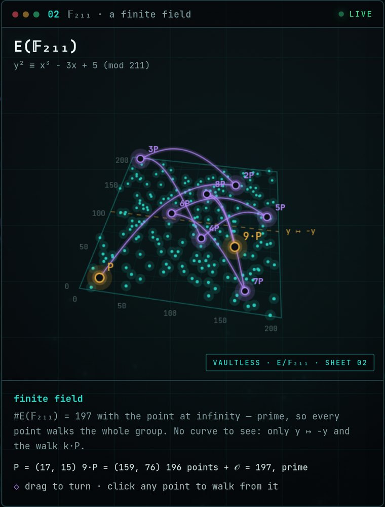
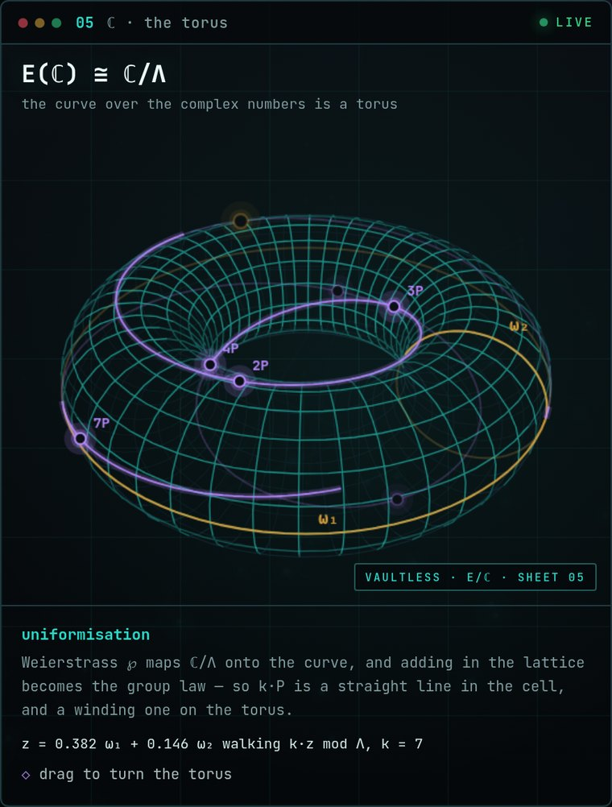

# vaultless

A vaultless, deterministic password manager. Every password is worked out on the
spot from two things: a passphrase in your head, and a key printed on a square of
paper — the *paper oracle*. Nothing is stored, so there is no vault to sync, back
up, or leak.

Live at **[vaultless.space](https://vaultless.space)**.



The first visit walks you through getting a paper oracle before it asks for
anything else:

```
scan the one you have, or: scribble → create → print ──→ phrase → account → style → password
```

Someone who already owns a sheet skips that:

```
this browser has used it     Welcome back → Unlock my passwords ─┐
                                                                 ├→ phrase → password
new laptop, private window   Already have an oracle? → scan ─────┘
```

## Using it

- **First time.** Scan the sheet you have, or make one: scribble in the box, create,
  and print it. Then type your phrase, pick an account number and a style, and press
  **Make my password**. The computation opens over the page and plays out as it
  happens — the phrase hashed onto the curve, stamped with the key from your sheet,
  HKDF filling in the characters. Then the masked characters lift off the pop-up
  and land, one by one, on the result card. **Skip** (or Escape) closes it and the
  password arrives at once; it is the same password either way.

  

- **Coming back on the same browser.** A *Welcome back* card lists the oracles this
  browser trusts, by fingerprint. One button opens the camera and lands you at the
  phrase box, with the last account number and style already filled in. The same
  card forgets an oracle you no longer use.
- **Coming back on a new browser.** Nothing is stored there, so there is nothing to
  welcome you back with — but *Already have an oracle?* opens the camera for your
  paper square (or lets you type its code) in one press. This browser has never seen
  the sheet, so the first derivation trusts it and names its fingerprint: check it
  against the one printed on the sheet.
- **One phrase, many passwords.** Change the account number for each site. The
  sheet is an input too, so the same phrase and number with a different sheet make
  a different password — which is why, once this browser trusts a sheet, a
  different one is stopped with a warning before any password is made.
- **Just looking?** *Take a look around* runs a demo against a simulated oracle with
  a throwaway key, playing the full two-party exchange. Nothing it shows is a real
  password.

Once a password is made:

- It appears **masked**. **Reveal** shows it; **Copy** puts it on the clipboard and
  clears the clipboard again 60 seconds later, if it still holds the password.
- The result, the phrase field and the clipboard copy are all wiped the moment the
  paper key goes away — forgotten or idled out.
- The paper key, scanned or just created, lives in one variable for the session. It
  is dropped after 5 minutes idle, on **Forget this oracle**, and on reload, and it is
  never written anywhere.

## What this site stores

Nothing secret. Every entry is in `localStorage` on this origin, and clearing site
data removes all of it.

| key | holds | why |
| --- | --- | --- |
| `vaultless.oracle.trusted.v1` | the public keys `Y = k·G` of the sheets you have accepted | the pin that catches a swapped sheet; also what the *Welcome back* card is shown for |
| `vaultless.lastuse.v1` | last account number and password style | pick up where you left off |
| `vaultless.mode.v1` | `simple` or `expert` | the explanation level |
| `vaultless.oracle.pubkey.v1` | a single pinned key, from before the set existed | read once to carry it into the set; never written |

Never stored: the passphrase, the paper oracle's `k`, any point, or any password.
Two keys from earlier versions are deleted on load: account nicknames
(`vaultless.accounts.v1`) and which kind of oracle you last chose
(`vaultless.oracle.choice.v1`), which meant nothing once paper was the only kind.

## How it works

1. The browser hashes `passphrase‖index` to a ristretto255 point `P`
   (hash-to-group, domain `oprf-vaultless-pwd-v1-HashToGroup`).
2. It computes `S = k·P` with the key `k` from your sheet. Before that it checks the
   sheet's public key `Y = k·G` against the ones this browser pinned on first use, so
   a different sheet is caught instead of silently yielding different passwords.
3. `S` is expanded through HKDF-SHA256 (salt: the account number) into the password,
   in the style you picked.

Same phrase, same account number, same sheet: same password, on any computer,
forever. Recovering any password needs both the phrase *and* the sheet.

`S = k·P` is exactly the output of a two-party oblivious PRF keyed by `k`, and the
demo plays it that way against a simulated oracle: the browser blinds `B = r·P`, the
oracle returns `B' = k·B` with a Chaum-Pedersen DLEQ proof that
`log_G(Y) == log_B(B')`, and the browser verifies it and unblinds `r⁻¹·B' = k·P`. The
blinding cancels, so both roads reach the same point. The browser also refuses an
oracle whose `Y` or `B'` is the identity: a `k = 0` oracle produces a proof that
*verifies*, and would drive every passphrase to the same public password.

### The paper oracle

The sheet carries `k` itself, printed as a QR square and a typable code.

The printed code is `VLT1-` followed by 58 Crockford base32 characters — 63 in all,
encoding `k` (32 bytes) and a SHA-256 checksum (4 bytes). Crockford omits `I`, `L`,
`O` and `U` so nothing can be misread by eye or by hand; input maps `I`/`L`→`1` and
`O`→`0` and ignores case and separators. The checksum is what stops a misread
decoding to a *different* key and silently producing wrong passwords. 63 alphanumeric
characters fit a version-5 QR at error-correction level H (30% recovery), which is
what paper in a drawer needs.

Creating one asks you to scribble in a box, and the pointer track is folded in:

```
k = reduce(SHA-512(dst ‖ ctr ‖ 64 CSPRNG bytes ‖ drawn bytes))
```

The system CSPRNG is always the base and the drawing goes on top, never in place of
it — hashing extra material together with fresh `crypto.getRandomValues` bytes cannot
make the result more predictable than those bytes alone, however lazy the scribble.

> **What paper costs.** `k` enters your computer on every scan, and a photograph of
> the sheet is a perfect clone. This is the paper-key model (passphrase + high-entropy
> key file): sound, but only as safe as the computer you scan it on and the drawer you
> keep it in. Scan it only on a machine you trust, print two, and store them apart.
> The sheet is **not** encrypted under your passphrase: that would let the passphrase
> alone reconstruct `k`, collapsing two factors into one.

### The hardware oracle, retired

vaultless used to offer a second kind of oracle: an ESP32 board that held `k` and
answered the blinded exchange over USB. It was removed so that the site has one kind
of oracle, and so the firmware installer — the largest third-party code the page
loaded, which could read the phrase box — is gone with it. The demo keeps the
two-party exchange as an illustration. A device's key cannot be exported, so a device
cannot be turned into a sheet; the last version with the device path is commit
`affbcc3`, in this repo's history, for anyone who needs it.

## The look

The page is drawn after the sheets in [Ak1ra00/oracle](https://github.com/Ak1ra00/oracle),
and none of its diagrams are pictures — each one is computed from the maths it
shows, and each one can be taken hold of. The home page shows one curve,
`y² = x³ − 3x + 5`, three ways at once, each in its own live window: side by side
on a wide screen, two above one on a tablet, one under another on a phone.

| | | |
| --- | --- | --- |
|  |  |  |
| **01 ℝ** — drag `P` and `Q`; the chord, the third point and `P + Q` follow. | **02 𝔽₂₁₁** — all 196 points of `y² ≡ x³ − 3x + 5 (mod 211)`. The group has 197 elements, a prime, so every point walks the whole of it. Click one to walk from it. | **05 ℂ** — over the complex numbers the curve is a torus, `ℂ/Λ`, and scalar multiplication is the straight line `k·z mod Λ` wound round it. Drag to turn it. |

Behind the whole page is a scene in depth, and every layer of it is the same maths:

- far off, `E(ℂ)` again, as a vast faint torus turning in the dark above a blueprint
  floor that runs to a horizon. It sits on a canvas of its own, drawn small and a few
  times a second, so it costs next to nothing and reads as out of focus;
- the ring: `E(𝔽₂₁₁)` laid out in scalar order, the walk `P, 2P, 3P, …` joining
  neighbours that land nowhere near each other — the discrete-log problem, drawn;
- comets running that walk, one group operation per step, much faster while a
  derivation is running;
- the formulas the oracle works with, drifting in depth; a pointer that lights the
  points near it and reaches out to them; soft light in the foreground.

The handshake pop-up draws the computation itself on the same curve over ℝ. Its one
real branch is a circle group, and on it sits a cyclic subgroup of prime order 197:
the dots. Each step is walked across that group by genuine double-and-add, one
chord or tangent per hop. The line meets the curve a third time, the reflection is
the sum, and the bits of the scalar light up as they are spent. With your sheet, `k` walks `P`
straight to `S = k·P`. In the demo, `r` walks `P` to `B`, the oracle's `k` walks `B`
to `B′`, and `r⁻¹` walks it home, landing exactly on `k·P`. The scalars and `P` in the
picture are made up; the real ones are in ristretto255, whose order ℓ runs round
the projector at the bottom.

The readout under it shows `B` and `B′` in full, because they are the only values
that leave the machine and are public anyway. It does **not** show `P` or `S`.
`P = H(phrase ‖ account)` would let anyone with a screenshot test guesses at the
phrase offline, without the oracle. `S` is one hash away from the password, which
stays masked.

The windows and the backdrop live in `scene.js`, and the handshake drawing in
`handshake.js`. Both are walled off from the passwords:

- Each imports nothing and is loaded by its own `<script>` tag, so each is a
  separate module graph. If either throws, derivation carries on.
- `scene.js` reads only two classes on `<body>`: `handshaking`, and `hs-open`
  while the pop-up covers the page. `handshake.js` reads only the stage name, which oracle path is in use, the
  password's length (set by the style) and the readout, which only ever holds
  `B` and `B′`. No phrase, key, `P`, `S` or password is reachable from either,
  and the curves they draw are toys over ℝ and 𝔽₂₁₁ that share nothing with
  ristretto255. The one thing `handshake.js` writes back is where it drew the
  finale's character slots, so the delivery flight knows where to take off from.
- With reduced motion on, nothing slides, spins or zooms, but nothing freezes
  either. All three windows keep drifting, at a third of the speed, with no scroll
  or pointer parallax. The full-screen backdrop holds still — nothing turns, no
  comets travel, nothing follows the scroll — and lives by light alone: the points
  twinkle and the far torus breathes. The handshake plays as fades — lines and
  points appearing where they are, packets dissolving from one end of the wire to
  the other — at a shorter dwell, ending in a cross-fade instead of the flight.
- Nothing animates off-screen, in a hidden tab, or underneath the pop-up, and a
  window draws only while its picture is at least a quarter on screen.
- A device that cannot keep up gets a lighter page. A couple of seconds in, the
  backdrop checks how often frames actually arrive; if most come slower than about
  40 a second, every canvas drops to fewer pixels and fewer frames for the rest of
  the visit. It never switches back, so the page never flickers between the two.

## Repo layout

```
index.html             the page: markup only
styles.css             the stylesheet — the CSP allows no inline <style> element
app.js                 derivation (paper, and the demo's simulated oracle), DLEQ
                         verification, trusted-key pinning, clipboard scrub
ui.js                  chrome: the welcome-back and quick-entry cards, simple/expert
                         switch, passphrase meter, account number, the handshake
                         pop-up and its pacing, masking and reveal
sheet.js               paper oracle UI: entropy pad, scanning, printing, key lifetime
recovery.js            paper oracle codec: Crockford base32, checksum, QR draw/scan
scene.js               the three live windows and the backdrop — isolated, see "The look"
handshake.js           the handshake pop-up's drawing — isolated the same way
                         (every script loads as a module, so the page runs under a
                          strict CSP with script-src 'self' and no inline script)
sw.js                  offline shell: the app is served cache-first, so the code you
                         reviewed is the code that runs
vendor/                vendored dependencies — see vendor/VENDOR.md. Nothing in the
  noble-bundle.js        runtime is fetched from a CDN: a third party able to serve
  qr-bundle.js           script here could read the passphrase and every password.
  fonts/                 Fonts are vendored too, so the CSP can forbid every
                         external origin outright.
manifest.json          PWA manifest for the site itself
icons/, favicon.svg    site icons
docs/                  the screenshots in this README
.github/workflows/     CI: audits vendor/ against the npm registry
```

## Moving domains

The site moved to `vaultless.space` from an earlier domain. Derivation is entirely
domain-independent — same phrase, same oracle, same passwords — but three things do
not travel, and one of them matters:

- **The trusted-key set does not move.** `localStorage` is per-origin, so on the new
  domain every browser starts with nothing pinned and the next derivation trusts your
  oracle on first use. That is exactly the case the pin exists to catch, so the first
  use now says which fingerprint it is trusting: compare it against the one printed
  on your sheet before you rely on the password.
  The last account number and style and the simple/expert preference are lost the
  same way — none of them secret, all of them one visit
  to set again.

- **Sheets printed before the move name the old domain.** The key on them is fine —
  it is just 32 bytes and cares nothing for DNS — but the instruction line points
  somewhere that may no longer resolve. Either keep a redirect on the old domain or
  reprint from the same key.

- **Browsers that visited the old domain cached it.** The service worker there serves
  the shell cache-first, so anyone who used the old address keeps getting that copy of
  the app, offline-first, even after the domain stops resolving — frozen, and no longer
  receiving updates. To close that out, serve a page from the OLD origin that
  unregisters the worker and redirects here.

## Security

Found a vulnerability? Please report it privately — see [SECURITY.md](SECURITY.md).

## License

[MIT](LICENSE) © 2026 S.K.
